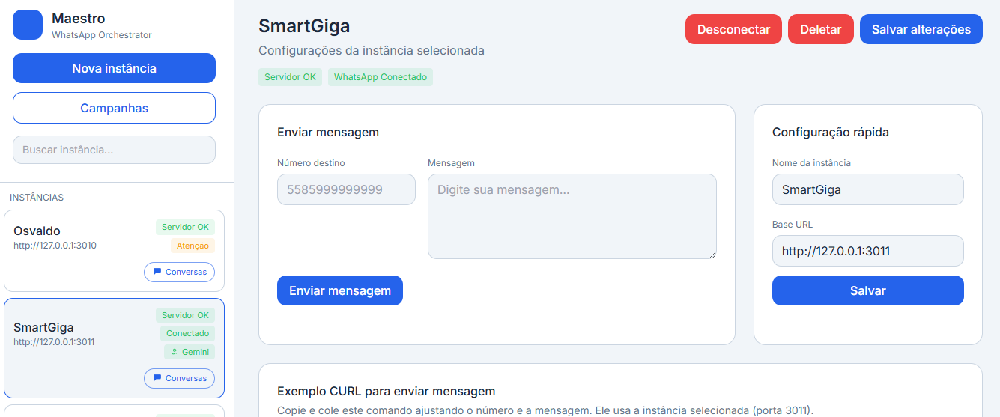
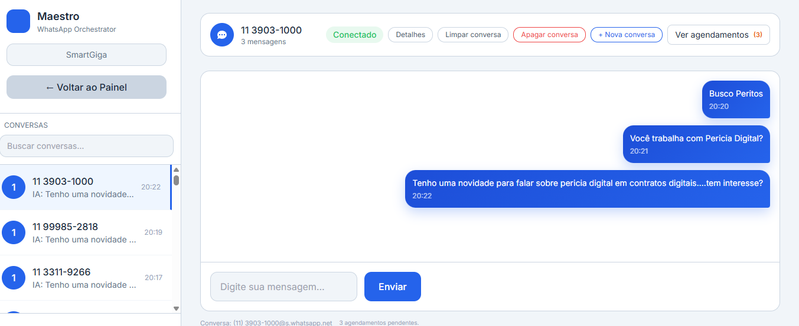

# Maestro – Orquestrador WhatsApp v1.5

<p align="center">
  
  &nbsp; &nbsp;
  
</p>

Maestro é um sistema de gerenciamento multi-instância para WhatsApp, permitindo orquestrar múltiplas instâncias da API de forma centralizada. A versão 1.5 introduz gerenciamento de múltiplos usuários (Gerente/Operador), permitindo controle de acesso granular às instâncias.

O sistema foi atualizado para utilizar um banco de dados **SQLite** como fonte única de verdade, eliminando a necessidade de arquivos `instances.json`.

---

# Maestro – WhatsApp Orchestrator v1.5

Maestro is a multi-instance WhatsApp management system that allows you to orchestrate multiple API instances centrally. Version 1.5 introduces multi-user management (Manager/Operator), enabling granular access control to instances.

The system now uses a **SQLite** database as the single source of truth, eliminating the need for `instances.json` files.

---

## Funcionalidades (PT)

- **Gerenciamento Multi-Usuário**: Crie usuários com perfis de **Gerente** (acesso total às instâncias designadas) ou **Operador** (acesso apenas ao chat).
- **Controle de Acesso**: Designe quais instâncias cada usuário pode acessar.
- **Gerenciamento Multi-Instância**: Crie e gerencie múltiplas instâncias do WhatsApp a partir de um banco de dados central.
- **Autenticação por QR Code**: Gere e exiba códigos QR para autenticação.
- **Automação com IA**: Respostas automáticas com IA (OpenAI e Gemini).
- **Dashboard de Chat**: Interface no estilo WhatsApp para visualização e resposta a conversas.

## Features (EN)

- **Multi-User Management**: Create users with **Manager** (full access to designated instances) or **Operator** (chat-only access) profiles.
- **Access Control**: Assign which instances each user can access.
- **Multi-Instance Management**: Create and manage multiple WhatsApp instances from a central database.
- **QR Code Authentication**: Generate and display QR codes for authentication.
- **AI-Powered Automation**: Automatic AI-powered responses (OpenAI and Gemini).
- **Chat Dashboard**: WhatsApp-style interface for viewing and responding to conversations.

---

## Tecnologias (PT)

- **Backend**: PHP 8.0+, Node.js 18+
- **Frontend**: HTML5, Tailwind CSS, JavaScript
- **Banco de Dados**: SQLite
- **Integração WhatsApp**: Baileys
- **Integração IA**: OpenAI (GPT), Gemini

## Technologies (EN)

- **Backend**: PHP 8.0+, Node.js 18+
- **Frontend**: HTML5, Tailwind CSS, JavaScript
- **Database**: SQLite
- **WhatsApp Integration**: Baileys
- **AI Integration**: OpenAI (GPT), Gemini

---

## Instalação (PT)

1.  **Clone o repositório:**
    ```bash
    git clone https://github.com/ojaneri/maestro.git
    cd maestro
    ```

2.  **Instale as dependências:**
    ```bash
    composer install
    npm install
    ```

3.  **Configure as variáveis de ambiente:**
    Crie um arquivo `.env` para o usuário **Admin** principal.
    ```env
    PANEL_PASSWORD=sua-senha-segura
    ```

4.  **Inicie o sistema:**
    ```bash
    php -S localhost:8080 index.php
    ```
    O banco de dados `chat_data.db` será criado automaticamente.

## Installation (EN)

1.  **Clone the repository:**
    ```bash
    git clone https://github.com/ojaneri/maestro.git
    cd maestro
    ```

2.  **Install dependencies:**
    ```bash
    composer install
    npm install
    ```

3.  **Configure environment variables:**
    Create a `.env` file for the main **Admin** user.
    ```env
    PANEL_PASSWORD=your-secure-password
    ```

4.  **Start the system:**
    ```bash
    php -S localhost:8080 index.php
    ```
    The `chat_data.db` database will be created automatically.

---

## Gerenciamento de Usuários (PT)

- **Admin**: O usuário principal, configurado via `.env`, tem acesso a todas as funcionalidades, incluindo a criação de outros usuários.
- **Gerente (Manager)**: Pode gerenciar e configurar as instâncias que lhe foram atribuídas.
- **Operador (User)**: Pode apenas visualizar e responder a conversas nas instâncias que lhe foram atribuídas.

O Admin pode criar novos usuários na interface principal do painel.

## User Management (EN)

- **Admin**: The main user, configured via `.env`, has access to all features, including creating other users.
- **Manager**: Can manage and configure the instances assigned to them.
- **Operator (User)**: Can only view and respond to conversations in the instances assigned to them.

The Admin can create new users in the main dashboard interface.

---

## Esquema do Banco de Dados (SQL)

O sistema utiliza um banco de dados SQLite (`chat_data.db`) para armazenar todas as informações.

```sql
CREATE TABLE IF NOT EXISTS settings (
    instance_id TEXT NOT NULL DEFAULT '',
    key TEXT NOT NULL,
    value TEXT,
    PRIMARY KEY (instance_id, key)
);

CREATE TABLE IF NOT EXISTS instances (
    instance_id TEXT PRIMARY KEY,
    name TEXT,
    port INTEGER,
    api_key TEXT,
    status TEXT,
    connection_status TEXT,
    base_url TEXT,
    phone TEXT,
    created_at DATETIME DEFAULT CURRENT_TIMESTAMP,
    updated_at DATETIME DEFAULT CURRENT_TIMESTAMP
);

CREATE TABLE IF NOT EXISTS external_users (
    id INTEGER PRIMARY KEY AUTOINCREMENT,
    name TEXT NOT NULL,
    email TEXT NOT NULL UNIQUE,
    password_hash TEXT NOT NULL,
    role TEXT NOT NULL CHECK(role IN ('user','manager')) DEFAULT 'user',
    status TEXT NOT NULL DEFAULT 'active',
    created_at DATETIME DEFAULT CURRENT_TIMESTAMP
);

CREATE TABLE IF NOT EXISTS external_user_instance_access (
    user_id INTEGER NOT NULL,
    instance_id TEXT NOT NULL,
    FOREIGN KEY(user_id) REFERENCES external_users(id) ON DELETE CASCADE,
    UNIQUE(user_id, instance_id)
);

CREATE TABLE IF NOT EXISTS messages (
    id INTEGER PRIMARY KEY AUTOINCREMENT,
    instance_id TEXT NOT NULL,
    remote_jid TEXT NOT NULL,
    role TEXT NOT NULL CHECK(role IN ('user', 'assistant')),
    content TEXT NOT NULL,
    direction TEXT CHECK(direction IN ('inbound','outbound')) NOT NULL DEFAULT 'inbound',
    metadata TEXT,
    timestamp DATETIME DEFAULT CURRENT_TIMESTAMP,
    created_at DATETIME DEFAULT CURRENT_TIMESTAMP
);

CREATE TABLE IF NOT EXISTS threads (
    id INTEGER PRIMARY KEY AUTOINCREMENT,
    instance_id TEXT NOT NULL,
    remote_jid TEXT NOT NULL,
    thread_id TEXT NOT NULL,
    last_message_id TEXT,
    updated_at DATETIME DEFAULT CURRENT_TIMESTAMP,
    UNIQUE(instance_id, remote_jid)
);

CREATE TABLE IF NOT EXISTS contact_metadata (
    instance_id TEXT NOT NULL,
    remote_jid TEXT NOT NULL,
    contact_name TEXT,
    status_name TEXT,
    profile_picture TEXT,
    updated_at DATETIME DEFAULT CURRENT_TIMESTAMP,
    PRIMARY KEY (instance_id, remote_jid)
);

CREATE TABLE IF NOT EXISTS scheduled_messages (
    id INTEGER PRIMARY KEY AUTOINCREMENT,
    instance_id TEXT NOT NULL,
    remote_jid TEXT NOT NULL,
    message TEXT NOT NULL,
    scheduled_at TEXT NOT NULL,
    status TEXT NOT NULL CHECK(status IN ('pending','sent','failed')) DEFAULT 'pending',
    last_attempt_at TEXT,
    error TEXT,
    is_paused INTEGER NOT NULL DEFAULT 0,
    tag TEXT NOT NULL DEFAULT 'default',
    tipo TEXT NOT NULL DEFAULT 'followup',
    campaign_id TEXT,
    created_at DATETIME DEFAULT CURRENT_TIMESTAMP,
    updated_at DATETIME DEFAULT CURRENT_TIMESTAMP
);

CREATE TABLE IF NOT EXISTS contact_context (
    instance_id TEXT NOT NULL,
    remote_jid TEXT NOT NULL,
    key TEXT NOT NULL,
    value TEXT,
    created_at DATETIME DEFAULT CURRENT_TIMESTAMP,
    updated_at DATETIME DEFAULT CURRENT_TIMESTAMP,
    PRIMARY KEY (instance_id, remote_jid, key)
);

CREATE TABLE IF NOT EXISTS event_logs (
    id INTEGER PRIMARY KEY AUTOINCREMENT,
    instance_id TEXT NOT NULL,
    remote_jid TEXT,
    category TEXT NOT NULL,
    description TEXT NOT NULL,
    metadata TEXT,
    created_at DATETIME DEFAULT CURRENT_TIMESTAMP
);
```

---

## Estrutura do Projeto (PT)

```
maestro/
├── index.php                 # Painel principal do Admin
├── api.php                   # Endpoints da API
├── external_auth.php         # Lógica de autenticação para múltiplos usuários
├── external_dashboard.php    # Painel para usuários externos (Gerente/Operador)
├── dashboard_chat.php        # Interface do dashboard de chat
├── db-updated.js             # Módulo de gerenciamento do banco de dados
├── whatsapp-server-intelligent.js # Servidor Node.js para as instâncias Baileys
├── composer.json             # Dependências do PHP
├── package.json              # Dependências do Node.js
├── .env                      # Arquivo para variáveis de ambiente (NÃO versionar)
├── chat_data.db              # Banco de dados SQLite (NÃO versionar)
└── README.md                 # Este arquivo
```

## Project Structure (EN)

```
maestro/
├── index.php                 # Main Admin dashboard
├── api.php                   # API endpoints
├── external_auth.php         # Authentication logic for multi-users
├── external_dashboard.php    # Dashboard for external users (Manager/Operator)
├── dashboard_chat.php        # Chat dashboard interface
├── db-updated.js             # Database management module
├── whatsapp-server-intelligent.js # Node.js server for Baileys instances
├── composer.json             # PHP dependencies
├── package.json              # Node.js dependencies
├── .env                      # File for environment variables (DO NOT commit)
├── chat_data.db              # SQLite database (DO NOT commit)
└── README.md                 # This file
```

---

## Créditos (Credits)

Desenvolvido por (Developed by) **Osvaldo J. Filho**
- **Website**: [perito.digital](https://perito.digital)
- **LinkedIn**: [linkedin.com/in/ojaneri](https://linkedin.com/in/ojaneri)
