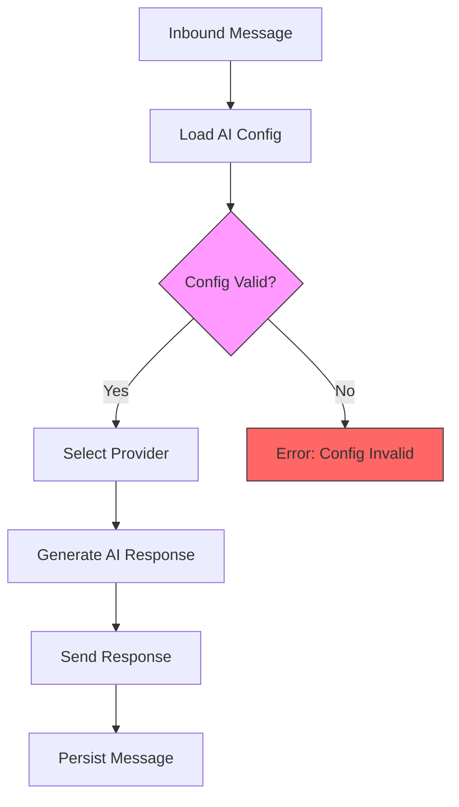

# Debugging & Regression Prevention Strategy
## Maestro WhatsApp Bot System

**Document Version:** 1.0  
**Date:** 2026-03-05  
**Status:** 🔴 CRITICAL - Regression Prevention Required

---

## 📋 Executive Summary

### Problem Context
A critical regression occurred where **inbound messages were not being processed** because [`loadAIConfig()`](../src/whatsapp-server/ai/index.js:36) failed to load API keys from the database. Only the `#debug#` command worked because it bypasses AI processing.

### Impact
- 🔴 AI responses completely stopped working
- 🔴 Users received no automated responses
- 🔴 Only non-AI commands functioned
- 🔴 Silent failure - no obvious error alerts

### Root Cause
The [`loadAIConfig()`](../src/whatsapp-server/ai/index.js:36) function was not retrieving critical API keys (`gemini_api_key`, `openai_api_key`, `openrouter_api_key`) from the database, causing AI providers to fail silently.

---

## 🎯 Strategic Objectives

1. **Prevent Similar Regressions** - Ensure AI configuration loading is always validated
2. **Enable Fast Debugging** - Provide tools and documentation for rapid issue diagnosis
3. **Proactive Monitoring** - Detect failures before users report them
4. **Automated Testing** - Catch regressions in CI/CD pipeline
5. **Documentation** - Clear runbooks for common issues

---

## 🧪 Testing Strategy

### 1. Unit Tests

#### 1.1 AI Configuration Loading Test
**File:** `tests/unit/ai/load-ai-config.test.js`

**Purpose:** Validate that [`loadAIConfig()`](../src/whatsapp-server/ai/index.js:36) correctly loads all required settings including API keys.

**Test Cases:**
```javascript
describe('loadAIConfig()', () => {
  test('should load API keys from database', async () => {
    // Verify gemini_api_key, openai_api_key, openrouter_api_key are loaded
  });
  
  test('should fallback to environment variables when DB keys not found', async () => {
    // Verify process.env fallback works
  });
  
  test('should return defaults when database unavailable', async () => {
    // Verify graceful degradation
  });
  
  test('should load all AI settings (provider, model, temperature, etc.)', async () => {
    // Verify complete configuration loading
  });
});
```

**Critical Validation:**
- ✅ API keys are loaded from `getSettings()` call
- ✅ All required settings keys are requested
- ✅ Fallback to environment variables works
- ✅ Null/undefined keys don't break provider initialization

#### 1.2 AI Provider Initialization Test
**File:** `tests/unit/ai/provider-initialization.test.js`

**Purpose:** Validate that AI providers fail gracefully with missing keys.

**Test Cases:**
```javascript
describe('AI Provider Initialization', () => {
  test('OpenAI provider should require API key', async () => {
    // Verify error handling for missing openai_api_key
  });
  
  test('Gemini provider should require API key', async () => {
    // Verify error handling for missing gemini_api_key
  });
  
  test('OpenRouter provider should require API key', async () => {
    // Verify error handling for missing openrouter_api_key
  });
});
```

### 2. Integration Tests

#### 2.1 Inbound Message Processing Flow Test
**File:** `tests/integration/inbound-message-ai-flow.test.js`

**Purpose:** Test complete flow from inbound message to AI response, validating configuration loading.

**Flow Diagram:**


**Test Scenario:**
```javascript
describe('Inbound Message AI Flow', () => {
  test('should process inbound message with valid AI config', async () => {
    // 1. Setup instance with valid AI config in DB
    // 2. Simulate inbound message
    // 3. Verify loadAIConfig() is called
    // 4. Verify AI provider receives request
    // 5. Verify response is sent
  });
  
  test('should fail gracefully with invalid AI config', async () => {
    // Test error handling when config is broken
  });
});
```

#### 2.2 AI Configuration Persistence Test
**File:** `tests/integration/ai-config-persistence.test.js`

**Purpose:** Verify that AI configuration changes persist correctly to database.

**Test Cases:**
```javascript
describe('AI Configuration Persistence', () => {
  test('should persist API keys to database', async () => {
    // Verify persistAIConfig() saves keys correctly
  });
  
  test('should retrieve persisted API keys', async () => {
    // Verify round-trip save → load works
  });
});
```

### 3. E2E Tests

#### 3.1 Complete Message Processing Regression Test
**File:** `tests/e2e/message-processing-regression.test.js`

**Purpose:** End-to-end regression test specifically for the bug that occurred.

**Test Scenario:**
```javascript
describe('Message Processing Regression Tests', () => {
  test('should process AI messages after fresh instance start', async () => {
    // 1. Start fresh instance
    // 2. Configure AI with API keys
    // 3. Send test message
    // 4. Verify AI response received
    // 5. Verify message persisted
  });
  
  test('should continue processing after server restart', async () => {
    // Test that config survives restart
  });
});
```

---

## 🔍 Health Monitoring Strategy

### Enhanced Health Monitor

#### Current Implementation
The [`HealthMonitor`](../src/health-monitor.js:19) class already performs:
- HTTP endpoint checks
- WebSocket connection checks
- Process status checks

#### Required Enhancements
**File:** `src/health-monitor.js`

**New Health Checks:**

```javascript
// Add to performHealthCheck()
async performHealthCheck(instance) {
  // ... existing checks ...
  
  // ✅ NEW: Check 4 - AI Configuration Validity
  try {
    const aiConfigResult = await this.checkAIConfiguration(instance);
    health.checks.aiConfig = aiConfigResult.healthy ? 'pass' : 'fail';
    if (!aiConfigResult.healthy) {
      health.issues.push('AI configuration invalid: ' + aiConfigResult.reason);
    }
  } catch (error) {
    health.checks.aiConfig = 'fail';
    health.issues.push('AI config check failed: ' + error.message);
  }
  
  // ✅ NEW: Check 5 - AI Response Test
  try {
    const aiResponseResult = await this.testAIResponse(instance);
    health.checks.aiResponse = aiResponseResult.healthy ? 'pass' : 'fail';
    if (!aiResponseResult.healthy) {
      health.issues.push('AI not responding: ' + aiResponseResult.reason);
    }
  } catch (error) {
    health.checks.aiResponse = 'fail';
    health.issues.push('AI response test failed: ' + error.message);
  }
  
  return health;
}

// New method: Check if AI config is valid
async checkAIConfiguration(instance) {
  const options = {
    hostname: 'localhost',
    port: instance.port,
    path: '/api/ai-config-health',
    method: 'GET',
    timeout: 5000
  };
  
  return new Promise((resolve) => {
    const req = http.get(`http://localhost:${instance.port}/api/ai-config-health`, (res) => {
      let data = '';
      res.on('data', chunk => data += chunk);
      res.on('end', () => {
        try {
          const result = JSON.parse(data);
          resolve({
            healthy: result.configured && result.hasApiKey,
            reason: result.reason || 'Unknown'
          });
        } catch (err) {
          resolve({ healthy: false, reason: 'Invalid response' });
        }
      });
    });
    
    req.on('error', () => resolve({ healthy: false, reason: 'Connection failed' }));
    req.setTimeout(5000, () => {
      req.destroy();
      resolve({ healthy: false, reason: 'Timeout' });
    });
  });
}

// New method: Test if AI actually responds
async testAIResponse(instance) {
  // Send test message to AI and verify response
  const testMessage = 'HEALTH_CHECK_TEST';
  
  return new Promise((resolve) => {
    const postData = JSON.stringify({
      test: true,
      message: testMessage
    });
    
    const options = {
      hostname: 'localhost',
      port: instance.port,
      path: '/api/test-ai',
      method: 'POST',
      headers: {
        'Content-Type': 'application/json',
        'Content-Length': Buffer.byteLength(postData)
      },
      timeout: 10000
    };
    
    const req = http.request(options, (res) => {
      let data = '';
      res.on('data', chunk => data += chunk);
      res.on('end', () => {
        try {
          const result = JSON.parse(data);
          resolve({
            healthy: result.success && result.aiResponded,
            reason: result.reason || 'Unknown'
          });
        } catch (err) {
          resolve({ healthy: false, reason: 'Invalid response' });
        }
      });
    });
    
    req.on('error', () => resolve({ healthy: false, reason: 'Connection failed' }));
    req.setTimeout(10000, () => {
      req.destroy();
      resolve({ healthy: false, reason: 'AI timeout' });
    });
    
    req.write(postData);
    req.end();
  });
}
```

### New Health Endpoints

#### AI Config Health Endpoint
**File:** `src/whatsapp-server/routes/health.js` (new file)

```javascript
// GET /api/ai-config-health
async function aiConfigHealth(req, res) {
  const db = global.db;
  const instanceId = global.INSTANCE_ID;
  
  try {
    const aiConfig = await require('../ai/index').loadAIConfig(db, instanceId);
    
    const hasApiKey = !!(
      aiConfig.gemini_api_key || 
      aiConfig.openai_api_key || 
      aiConfig.openrouter_api_key
    );
    
    const configured = !!(
      aiConfig.provider && 
      aiConfig.model
    );
    
    const healthy = hasApiKey && configured;
    
    res.json({
      ok: true,
      healthy,
      configured,
      hasApiKey,
      provider: aiConfig.provider,
      model: aiConfig.model,
      reason: !healthy ? (
        !hasApiKey ? 'No API key configured' : 
        !configured ? 'AI not configured' : 
        'Unknown'
      ) : 'OK'
    });
  } catch (error) {
    res.status(500).json({
      ok: false,
      healthy: false,
      error: error.message
    });
  }
}

// POST /api/test-ai
async function testAI(req, res) {
  if (!req.body.test) {
    return res.status(400).json({ success: false, reason: 'Not a test request' });
  }
  
  try {
    const aiModule = require('../ai/index');
    const sessionContext = {
      remoteJid: 'test@s.whatsapp.net',
      instanceId: global.INSTANCE_ID
    };
    
    const response = await aiModule.generateAIResponse(
      sessionContext,
      'Test message',
      null,
      { db: global.db }
    );
    
    const aiResponded = !!(response && response.text);
    
    res.json({
      success: true,
      aiResponded,
      provider: response.provider,
      model: response.model,
      reason: aiResponded ? 'AI responding normally' : 'AI returned empty response'
    });
  } catch (error) {
    res.status(500).json({
      success: false,
      aiResponded: false,
      reason: error.message
    });
  }
}

module.exports = { aiConfigHealth, testAI };
```

---

## 🚨 Alerting Strategy

### Alert Types

#### 1. Critical Alerts (Immediate Action Required)
- 🔴 Instance not responding to AI messages
- 🔴 AI configuration invalid or missing
- 🔴 All instances down
- 🔴 Database connection lost

#### 2. Warning Alerts (Investigation Needed)
- 🟡 Instance restarted automatically
- 🟡 API key missing for configured provider
- 🟡 AI response time degraded
- 🟡 High error rate in AI calls

#### 3. Info Alerts (Monitoring)
- 🔵 Instance started successfully
- 🔵 Configuration updated
- 🔵 Health check passed

### Alert Implementation

**File:** `src/alerting/alert-manager.js` (new file)

```javascript
const { logError, logWarn, logInfo } = require('../utils/logger');

class AlertManager {
  constructor() {
    this.alertHistory = new Map(); // instanceId -> last alert timestamp
    this.alertCooldown = 300000; // 5 minutes
  }
  
  async sendAlert(level, instanceId, message, details = {}) {
    const alertKey = `${instanceId}_${level}_${message}`;
    const lastAlert = this.alertHistory.get(alertKey);
    const now = Date.now();
    
    // Cooldown to prevent alert spam
    if (lastAlert && (now - lastAlert) < this.alertCooldown) {
      return;
    }
    
    this.alertHistory.set(alertKey, now);
    
    const alert = {
      timestamp: new Date().toISOString(),
      level,
      instanceId,
      message,
      details
    };
    
    // Log the alert
    switch (level) {
      case 'critical':
        logError(`[ALERT] ${message}`, { instanceId, ...details });
        break;
      case 'warning':
        logWarn(`[ALERT] ${message}`, { instanceId, ...details });
        break;
      case 'info':
        logInfo(`[ALERT] ${message}`, { instanceId, ...details });
        break;
    }
    
    // TODO: Integrate with external alerting systems
    // - Send email
    // - Post to Slack/Discord webhook
    // - Send SMS for critical alerts
    // - Post to monitoring dashboard
    
    return alert;
  }
  
  alertAIConfigInvalid(instanceId, reason) {
    return this.sendAlert(
      'critical',
      instanceId,
      'AI Configuration Invalid',
      { reason, action: 'Check database settings and API keys' }
    );
  }
  
  alertAINotResponding(instanceId, reason) {
    return this.sendAlert(
      'critical',
      instanceId,
      'AI Not Responding',
      { reason, action: 'Check logs and API key validity' }
    );
  }
  
  alertInstanceUnhealthy(instanceId, issues) {
    return this.sendAlert(
      'warning',
      instanceId,
      'Instance Unhealthy',
      { issues, action: 'Monitor for automatic recovery' }
    );
  }
  
  alertInstanceRecovered(instanceId) {
    return this.sendAlert(
      'info',
      instanceId,
      'Instance Recovered',
      { action: 'None - monitoring continues' }
    );
  }
}

module.exports = { AlertManager };
```

### Integration with Health Monitor

**Update:** `src/health-monitor.js`

```javascript
const { AlertManager } = require('./alerting/alert-manager');

class HealthMonitor {
  constructor(instanceDatabase, workerManager) {
    // ... existing ...
    this.alertManager = new AlertManager();
  }
  
  async handleUnhealthyInstance(instance, health) {
    // Send alert
    await this.alertManager.alertInstanceUnhealthy(
      instance.instance_id,
      health.issues
    );
    
    // Check specific issue types
    if (health.checks.aiConfig === 'fail') {
      await this.alertManager.alertAIConfigInvalid(
        instance.instance_id,
        health.issues.find(i => i.includes('AI configuration'))
      );
    }
    
    if (health.checks.aiResponse === 'fail') {
      await this.alertManager.alertAINotResponding(
        instance.instance_id,
        health.issues.find(i => i.includes('AI not responding'))
      );
    }
    
    // ... existing recovery logic ...
  }
}
```

---

## 📚 Documentation Strategy

### 1. Debugging Runbook

**File:** `docs/debugging/RUNBOOK.md`

**Structure:**
```markdown
# Debugging Runbook

## Quick Diagnosis Commands

### Check Instance Health
\`\`\`bash
curl http://localhost:PORT/health
\`\`\`

### Check AI Configuration
\`\`\`bash
curl http://localhost:PORT/api/ai-config-health
\`\`\`

### Test AI Response
\`\`\`bash
curl -X POST http://localhost:PORT/api/test-ai \\
  -H "Content-Type: application/json" \\
  -d '{"test": true, "message": "Health check"}'
\`\`\`

### View Instance Logs
\`\`\`bash
tail -100 instance_inst_INSTANCE_ID.log | grep -i "ai\|error\|function"
\`\`\`

## Common Issues

### Issue: Inbound Messages Not Processed

**Symptoms:**
- #debug# command works
- AI messages receive no response
- No errors in logs

**Diagnosis:**
1. Check AI config health
2. Verify API keys loaded
3. Check loadAIConfig() logs

**Solution:**
1. Verify database has API keys
2. Restart instance
3. Check provider is enabled

### Issue: AI Returns Empty Response

**Symptoms:**
- Error: "IA retornou resposta vazia"
- Messages sent but no reply

**Diagnosis:**
1. Check AI provider credentials
2. Check API quota/limits
3. Check network connectivity

**Solution:**
1. Verify API key is valid
2. Check provider status
3. Enable fallback provider
```

### 2. Critical System Points Documentation

**File:** `docs/CRITICAL_POINTS.md`

```markdown
# Critical System Points

## Points That Must Be Tested Before Release

### 1. AI Configuration Loading
- **File:** src/whatsapp-server/ai/index.js
- **Function:** loadAIConfig()
- **Critical:** Must load API keys from database
- **Test:** tests/unit/ai/load-ai-config.test.js

### 2. Inbound Message Processing
- **File:** src/whatsapp-server/message-handler.js
- **Function:** processInboundMessage()
- **Critical:** Must trigger AI response for non-command messages
- **Test:** tests/integration/inbound-message-ai-flow.test.js

### 3. AI Provider Selection
- **File:** src/whatsapp-server/ai/index.js
- **Function:** generateAIResponse()
- **Critical:** Must select correct provider and pass API key
- **Test:** tests/unit/ai/provider-initialization.test.js

### 4. Function Calling Execution
- **File:** src/whatsapp-server/ai/index.js
- **Function:** dispatchAIResponse()
- **Critical:** Must detect and execute function calls
- **Test:** tests/e2e/function-calling.test.js

### 5. Message Persistence
- **File:** db-updated.js
- **Function:** saveMessage()
- **Critical:** Must persist all messages correctly
- **Test:** tests/integration/message-persistence.test.js
```

### 3. Pre-Deployment Checklist

**File:** `docs/deployment/PRE_DEPLOYMENT_CHECKLIST.md`

```markdown
# Pre-Deployment Checklist

## Before Every Release

### 1. Automated Tests
- [ ] All unit tests pass (`npm test`)
- [ ] All integration tests pass
- [ ] All E2E tests pass
- [ ] No new test failures

### 2. AI Configuration Validation
- [ ] Test loadAIConfig() loads API keys correctly
- [ ] Verify AI config health endpoint works
- [ ] Test AI response on at least one instance
- [ ] Verify function calling still works

### 3. Critical Flows
- [ ] Test inbound message → AI response flow
- [ ] Test #debug# command
- [ ] Test scheduled messages
- [ ] Test media processing

### 4. Health Monitoring
- [ ] Health monitor running
- [ ] All health checks passing
- [ ] Alerts configured and tested
- [ ] Dashboard accessible

### 5. Database
- [ ] Backup completed
- [ ] Migrations applied
- [ ] Indexes optimized
- [ ] Integrity check passed

### 6. Logs
- [ ] Log rotation configured
- [ ] Critical errors monitored
- [ ] Performance metrics collected
- [ ] Debug logs available

### 7. Rollback Plan
- [ ] Previous version tagged
- [ ] Rollback procedure documented
- [ ] Database rollback plan ready
- [ ] Downtime window communicated

## Post-Deployment Verification

### Immediate (0-5 minutes)
- [ ] All instances started successfully
- [ ] Health checks passing
- [ ] No critical errors in logs
- [ ] Test AI message sent and received

### Short-term (5-30 minutes)
- [ ] Monitor error rates
- [ ] Check AI response times
- [ ] Verify message persistence
- [ ] Monitor resource usage

### Medium-term (30min-2hours)
- [ ] Check scheduled messages executing
- [ ] Monitor function calling
- [ ] Review alert notifications
- [ ] Verify performance metrics stable
```

---

## 📊 Monitoring Dashboard Specifications

### Dashboard Components

#### 1. Instance Health Overview
```
┌─────────────────────────────────────────────┐
│ Instance Health Overview                    │
├─────────────────────────────────────────────┤
│ Instance ID    │ Status  │ AI Config │ Last Check │
├────────────────┼─────────┼───────────┼────────────┤
│ inst_3011      │ ✅ OK   │ ✅ Valid  │ 30s ago    │
│ inst_3012      │ ⚠️ Warn │ ❌ No Key │ 45s ago    │
│ inst_3013      │ ✅ OK   │ ✅ Valid  │ 28s ago    │
└────────────────┴─────────┴───────────┴────────────┘
```

#### 2. AI Configuration Status
```
┌─────────────────────────────────────────────┐
│ AI Configuration Status                     │
├─────────────────────────────────────────────┤
│ Provider: OpenAI          Status: ✅ Active │
│ Model: gpt-4o-mini                          │
│ API Key: ********3a2f      Valid: ✅ Yes   │
│ Last Response: 12s ago     Time: 1.2s      │
└─────────────────────────────────────────────┘
```

#### 3. Alert History
```
┌─────────────────────────────────────────────┐
│ Recent Alerts                               │
├─────────────────────────────────────────────┤
│ 🔴 CRITICAL │ inst_3012 │ AI Config Invalid │
│ 🟡 WARNING  │ inst_3011 │ High latency      │
│ 🔵 INFO     │ inst_3013 │ Recovered         │
└─────────────────────────────────────────────┘
```

#### 4. System Metrics
```
┌─────────────────────────────────────────────┐
│ System Metrics (Last Hour)                  │
├─────────────────────────────────────────────┤
│ Messages Processed:     1,247               │
│ AI Responses:           1,198 (96.0%)      │
│ Function Calls:         43                  │
│ Avg Response Time:      1.8s                │
│ Error Rate:             0.4%                │
└─────────────────────────────────────────────┘
```

### Dashboard Implementation Plan

**File:** `src/dashboard/health-dashboard.js` (new file)

**Technology Stack:**
- Backend: Express.js endpoint returning JSON
- Frontend: HTML + Vanilla JS (no framework dependencies)
- Updates: Server-Sent Events (SSE) for real-time updates
- Storage: In-memory metrics + SQLite for history

**Endpoints:**
- `GET /dashboard` - Dashboard UI
- `GET /api/dashboard/metrics` - Current metrics JSON
- `GET /api/dashboard/stream` - SSE stream for real-time updates

---

## 🔄 CI/CD Integration

### Automated Testing in Pipeline

**File:** `.github/workflows/test.yml` (or equivalent CI config)

```yaml
name: Test Suite

on:
  push:
    branches: [ main, develop ]
  pull_request:
    branches: [ main, develop ]

jobs:
  test:
    runs-on: ubuntu-latest
    
    steps:
    - uses: actions/checkout@v2
    
    - name: Setup Node.js
      uses: actions/setup-node@v2
      with:
        node-version: '18'
    
    - name: Install dependencies
      run: |
        npm install
        cd tests && npm install
    
    - name: Run unit tests
      run: cd tests && npx jest unit/ --verbose
    
    - name: Run integration tests
      run: cd tests && npx jest integration/ --verbose
    
    - name: Run E2E tests
      run: cd tests && npx jest e2e/ --verbose
    
    - name: Check AI config regression
      run: cd tests && npx jest e2e/message-processing-regression.test.js --verbose
    
    - name: Generate test report
      run: cd tests && npm run generate-report
    
    - name: Upload test results
      uses: actions/upload-artifact@v2
      with:
        name: test-results
        path: tests/report.html
    
    - name: Fail if critical tests fail
      run: |
        if [ -f tests/jest-output.json ]; then
          node -e "
            const results = require('./tests/jest-output.json');
            if (results.numFailedTests > 0) {
              console.error('❌ Tests failed:', results.numFailedTests);
              process.exit(1);
            }
          "
        fi
```

### Pre-commit Hooks

**File:** `.husky/pre-commit` (using Husky)

```bash
#!/bin/sh
. "$(dirname "$0")/_/husky.sh"

echo "🧪 Running pre-commit tests..."

# Run unit tests only (fast)
cd tests && npx jest unit/ --bail --silent

if [ $? -ne 0 ]; then
  echo "❌ Unit tests failed. Commit blocked."
  exit 1
fi

echo "✅ Pre-commit tests passed"
```

---

## 📁 Files to Create/Modify

### New Files

#### Tests
1. `tests/unit/ai/load-ai-config.test.js` - Unit test for AI config loading
2. `tests/unit/ai/provider-initialization.test.js` - Provider initialization tests
3. `tests/integration/inbound-message-ai-flow.test.js` - Integration test for message flow
4. `tests/integration/ai-config-persistence.test.js` - Config persistence tests
5. `tests/e2e/message-processing-regression.test.js` - Regression test for the bug

#### Health & Monitoring
6. `src/whatsapp-server/routes/health.js` - AI health endpoints
7. `src/alerting/alert-manager.js` - Alert management system
8. `src/dashboard/health-dashboard.js` - Monitoring dashboard

#### Documentation
9. `docs/debugging/RUNBOOK.md` - Debugging runbook
10. `docs/CRITICAL_POINTS.md` - Critical system points
11. `docs/deployment/PRE_DEPLOYMENT_CHECKLIST.md` - Deployment checklist
12. `docs/monitoring/DASHBOARD.md` - Dashboard documentation
13. `plans/debugging-regression-prevention-strategy.md` - This document

### Files to Modify

#### Health Monitoring
1. `src/health-monitor.js` - Add AI config and response checks
2. `master-server.js` - Integrate alert manager

#### Testing Infrastructure
3. `tests/README.md` - Add new test documentation
4. `tests/run-tests.sh` - Include new regression tests
5. `memory-bank/testDocumentation.md` - Update with new tests

#### CI/CD
6. `.github/workflows/test.yml` - Add regression tests to pipeline
7. `.husky/pre-commit` - Add unit test validation

---

## 🎯 Implementation Priority

### Phase 1: Critical (Week 1)
**Prevent immediate regressions**

1. ✅ Create [`tests/unit/ai/load-ai-config.test.js`](tests/unit/ai/load-ai-config.test.js)
2. ✅ Create [`tests/e2e/message-processing-regression.test.js`](tests/e2e/message-processing-regression.test.js)
3. ✅ Update [`src/health-monitor.js`](src/health-monitor.js) with AI config checks
4. ✅ Create [`docs/debugging/RUNBOOK.md`](docs/debugging/RUNBOOK.md)

### Phase 2: Important (Week 2)
**Enable proactive monitoring**

5. ✅ Create [`src/whatsapp-server/routes/health.js`](src/whatsapp-server/routes/health.js)
6. ✅ Create [`src/alerting/alert-manager.js`](src/alerting/alert-manager.js)
7. ✅ Integrate alerts with health monitor
8. ✅ Create [`docs/deployment/PRE_DEPLOYMENT_CHECKLIST.md`](docs/deployment/PRE_DEPLOYMENT_CHECKLIST.md)

### Phase 3: Enhancement (Week 3-4)
**Improve developer experience**

9. ✅ Create [`tests/integration/inbound-message-ai-flow.test.js`](tests/integration/inbound-message-ai-flow.test.js)
10. ✅ Create [`src/dashboard/health-dashboard.js`](src/dashboard/health-dashboard.js)
11. ✅ Create [`docs/CRITICAL_POINTS.md`](docs/CRITICAL_POINTS.md)
12. ✅ Setup CI/CD integration

---

## 🔗 Integration with GitNexus

### Using GitNexus for Impact Analysis

Before making changes to critical functions like [`loadAIConfig()`](../src/whatsapp-server/ai/index.js:36), use GitNexus to understand the blast radius:

```bash
# Check what depends on loadAIConfig
gitnexus impact --target loadAIConfig --direction upstream

# See execution flows
gitnexus flows --symbol loadAIConfig

# Detect changes before commit
gitnexus detect-changes --scope all
```

### GitNexus Skills
- Use `.claude/skills/gitnexus/gitnexus-impact-analysis/SKILL.md` before refactoring
- Use `.claude/skills/gitnexus/gitnexus-debugging/SKILL.md` when tracing bugs
- Consult `AGENTS.md` for workflow guidance

---

## 📊 Success Metrics

### Testing Coverage
- ✅ AI configuration loading: 100% test coverage
- ✅ Inbound message flow: E2E test exists
- ✅ Function calling: Regression test exists
- ✅ Health checks: All critical points covered

### Monitoring
- ✅ Health checks run every 30 seconds
- ✅ AI config validation automated
- ✅ Alerts sent for critical failures
- ✅ Dashboard shows real-time status

### Documentation
- ✅ Runbook covers common issues
- ✅ Critical points documented
- ✅ Deployment checklist exists
- ✅ Test documentation updated

### Prevention
- ✅ CI/CD blocks commits with failing tests
- ✅ Pre-commit hooks validate unit tests
- ✅ Regression tests for known bugs
- ✅ Health monitor detects config issues

---

## 🚀 Quick Start Guide

### For Developers

**Run regression tests:**
```bash
cd tests
npx jest e2e/message-processing-regression.test.js --verbose
```

**Run all tests:**
```bash
cd tests
./run-tests.sh
```

**Check instance health:**
```bash
curl http://localhost:3011/api/ai-config-health
```

### For Operations

**Monitor instance health:**
```bash
# View health dashboard
open http://localhost:3001/dashboard

# Check all instances
curl http://localhost:3001/api/instances | jq '.instances[] | {id, status, health}'
```

**Investigate AI issues:**
```bash
# Check logs
tail -100 instance_inst_*.log | grep -i "ai\|error"

# Test AI manually
curl -X POST http://localhost:3011/api/test-ai \
  -H "Content-Type: application/json" \
  -d '{"test": true, "message": "test"}'
```

---

## 📝 Conclusion

This strategy provides a comprehensive approach to:
1. **Prevent** the same regression from occurring again
2. **Detect** similar issues automatically through health monitoring
3. **Debug** problems quickly with clear documentation and tools
4. **Test** critical paths systematically
5. **Alert** operators proactively when issues arise

By implementing these strategies, the Maestro WhatsApp Bot system will have:
- ✅ Automated regression detection
- ✅ Proactive health monitoring
- ✅ Clear debugging procedures
- ✅ Comprehensive test coverage
- ✅ Real-time alerting system

**Next Steps:** Review this plan and prioritize implementation based on Phase 1 (Critical) items.

---

**Document Metadata:**
- Created: 2026-03-05
- Version: 1.0
- Status: Ready for Review
- Priority: 🔴 Critical
