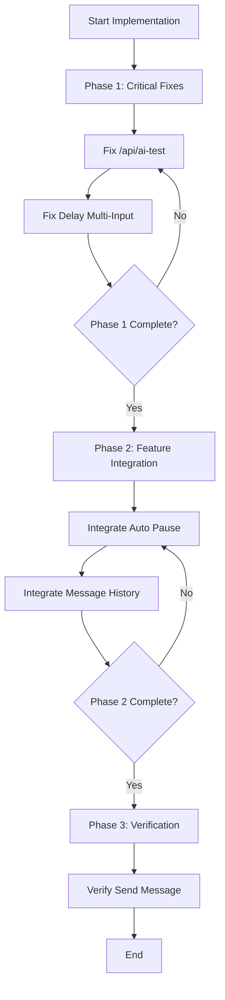

# WhatsApp Server Modular Codebase - Implementation Plan for Broken Functions

## Executive Summary

This document outlines the detailed implementation plan to fix five broken functions in the WhatsApp server modular codebase. Each section includes the identified issues, required code fixes, module dependencies, integration points, and recommended implementation sequence.

---

## 1. /api/ai-test Endpoint Fix

### Location
- **File**: `src/whatsapp-server/routes/api.js`
- **Lines**: 470-492

### Issues Identified

1. **Wrong parameter type passed to `ai.generateAIResponse()`**
   - Current (line 481): `ai.generateAIResponse(targetJid, message.trim(), testConfig)`
   - Expected: First parameter should be a `sessionContext` object with `remoteJid`, `instanceId`, etc.
   - Current passes a string `targetJid` instead of an object

2. **`ai.loadAIConfig()` called without required parameters**
   - Current (line 480): `await ai.loadAIConfig()`
   - Expected: `await ai.loadAIConfig(db, instanceId)`
   - The function signature is `async function loadAIConfig(db, instanceId)` (see ai/index.js:60)

3. **Missing WhatsApp connection check**
   - No verification that WhatsApp is connected before attempting AI processing
   - Should return 503 if not connected

### Required Code Fixes

```javascript
// Fixed /api/ai-test endpoint
router.post('/ai-test', async (req, res) => {
    try {
        const ai = require('../ai');
        const { isConnected, sock, db, INSTANCE_ID } = getDeps();
        
        // Add WhatsApp connection check
        if (!isConnected || !sock) {
            return res.status(503).json({ ok: false, error: "WhatsApp não conectado" });
        }
        
        const { message, remote_jid } = req.body || {};
        
        if (!message || typeof message !== "string" || !message.trim()) {
            return res.status(400).json({ ok: false, error: "Mensagem é obrigatória" });
        }
        
        const targetJid = remote_jid || `test-${INSTANCE_ID}`;
        
        // FIX 1: Create proper sessionContext object
        const sessionContext = {
            remoteJid: targetJid,
            instanceId: INSTANCE_ID,
            sessionId: `test-${Date.now()}`
        };
        
        // FIX 2: Pass db and instanceId to loadAIConfig
        const testConfig = { 
            ...await ai.loadAIConfig(db, INSTANCE_ID), 
            enabled: true 
        };
        
        // FIX 3: Pass sessionContext object instead of string
        const response = await ai.generateAIResponse(
            sessionContext, 
            message.trim(), 
            testConfig,
            { db, sock }
        );
        
        res.json({
            ok: true,
            provider: response.provider,
            response: response.text
        });
    } catch (err) {
        console.error("AI test failed:", err.message);
        res.status(500).json({ ok: false, error: "Falha ao testar IA", detail: err.message });
    }
});
```

### Module Dependencies
- `src/whatsapp-server/ai/index.js` - `loadAIConfig()`, `generateAIResponse()`
- `src/whatsapp-server/server/express-app.js` - `getDeps()` (db, sock, isConnected, INSTANCE_ID)

### Integration Points
- Uses existing `getDeps()` helper function from same file (lines 13-20)
- Uses existing AI module exports

---

## 2. Auto Pause Integration

### Location
- **Endpoint**: `src/routes/legacy-compat.routes.js:344-366` (exists but not integrated)
- **Config**: `src/whatsapp-server/ai/index.js` (loads `auto_pause_enabled`, `auto_pause_minutes`)
- **Message Processing**: `src/whatsapp-server/whatsapp/handlers/messages.js`

### Issues Identified

1. **Endpoint exists but not integrated into message processing flow**
   - `GET /api/auto-pause-status` endpoint exists in legacy-compat.routes.js
   - But it's NOT being called before AI response dispatch

2. **Auto-pause configuration loaded but not used**
   - `auto_pause_enabled` and `auto_pause_minutes` are loaded in `loadAIConfig()` (ai/index.js:125-126)
   - However, the message handler never checks these values before processing

3. **Missing time-since-last-message check**
   - Need to query `db.getTimeSinceLastInboundMessage()` to check if contact has been inactive
   - If inactive > threshold, skip AI processing

### Required Code Fixes

**In `src/whatsapp-server/whatsapp/handlers/messages.js`**, add auto-pause check:

```javascript
/**
 * Check if AI should be paused for this contact based on auto-pause settings
 * @param {string} remoteJid - Contact JID
 * @param {Object} aiConfig - AI configuration with auto_pause settings
 * @param {Object} db - Database instance
 * @returns {Promise<{shouldPause: boolean, hoursSinceLastInbound: number|null}>}
 */
async function checkAutoPause(remoteJid, aiConfig, db) {
    const result = { shouldPause: false, hoursSinceLastInbound: null };
    
    // Check if auto-pause is enabled in config
    if (!aiConfig?.auto_pause_enabled) {
        return result;
    }
    
    const thresholdHours = aiConfig.auto_pause_minutes ? 
        (aiConfig.auto_pause_minutes / 60) : 24;
    
    try {
        const lastInbound = await db.getTimeSinceLastInboundMessage(
            global.INSTANCE_ID || 'default',
            remoteJid
        );
        
        if (lastInbound) {
            const lastInboundDate = new Date(lastInbound);
            const hoursSinceLastInbound = (Date.now() - lastInboundDate.getTime()) / (1000 * 60 * 60);
            result.hoursSinceLastInbound = hoursSinceLastInbound;
            result.shouldPause = hoursSinceLastInbound > thresholdHours;
        }
    } catch (err) {
        console.warn('[Auto-Pause] Could not check last inbound time:', err.message);
    }
    
    return result;
}

// Update processMessageWithAI function to include auto-pause check
async function processMessageWithAI(msg, socket) {
    if (!msg.key?.fromMe && msg.message) {
        const remoteJid = msg.key.remoteJid;
        if (!remoteJid) return;
        
        const isGroup = isGroupJid(remoteJid);
        const isStatus = remoteJid.toLowerCase().startsWith('status@broadcast');
        
        // ... existing multi-input delay code ...
        
        // ADD AUTO-PAUSE CHECK HERE
        try {
            const instanceId = global.INSTANCE_ID || 'default';
            const aiConfig = await aiModule.loadAIConfig(db, instanceId);
            const autoPause = await checkAutoPause(remoteJid, aiConfig, db);
            
            if (autoPause.shouldPause) {
                console.log(`[Auto-Pause] Pausing AI for ${remoteJid} - ${autoPause.hoursSinceLastInbound?.toFixed(1)}h since last message`);
                return; // Skip AI processing
            }
        } catch (err) {
            console.warn('[Auto-Pause] Could not check auto-pause:', err.message);
        }
        
        // ... rest of existing code ...
    }
}
```

### Module Dependencies
- `src/whatsapp-server/ai/index.js` - `loadAIConfig()`
- `src/db-updated.js` - `getTimeSinceLastInboundMessage()`
- `src/whatsapp-server/whatsapp/handlers/messages.js` - existing message handler

### Integration Points
- Must be integrated at the beginning of `processMessageWithAI()` function
- Should run after multi-input delay check but before AI dispatch
- Requires `db` and `global.INSTANCE_ID` to be available

---

## 3. Delay Multi-Input Fix

### Location
- **Handler**: `src/whatsapp-server/whatsapp/handlers/messages.js`
- **Config**: `src/whatsapp-server/ai/index.js` (`ai_multi_input_delay`)

### Issues Identified

1. **Undefined instanceId in applyMultiInputDelay call**
   - Line 188: `const aiConfig = await aiModule.loadAIConfig(db, instanceId);`
   - `instanceId` is NOT defined at this point in the code
   - Should be `global.INSTANCE_ID || 'default'`

2. **Same issue on line 204**
   - Uses undefined `instanceId` in `db.saveMessage()`

### Required Code Fixes

```javascript
// In processMessageWithAI function, around line 186-192

// Apply multi-input delay before processing
try {
    // FIX: Use global.INSTANCE_ID instead of undefined instanceId
    const instanceId = global.INSTANCE_ID || 'default';
    const aiConfig = await aiModule.loadAIConfig(db, instanceId);
    await applyMultiInputDelay(remoteJid, aiConfig);
} catch (err) {
    console.warn('[Multi-Input Delay] Could not load AI config:', err.message);
}

// Later, in saveMessage call (around line 203)
await db.saveMessage(
    instanceId,  // FIX: Use defined instanceId instead of undefined
    remoteJid,
    // ... rest of parameters
);
```

### Module Dependencies
- `src/whatsapp-server/ai/index.js` - `loadAIConfig()`
- `src/whatsapp-server/whatsapp/handlers/messages.js` - `applyMultiInputDelay()`

### Integration Points
- Fix variable reference in existing `processMessageWithAI()` function
- The `applyMultiInputDelay()` function already exists and works correctly (lines 81-106)

---

## 4. Message History Integration

### Location
- **AI Module**: `src/whatsapp-server/ai/index.js`
- **Providers**: `src/whatsapp-server/ai/providers/openai.js`, `gemini.js`, `openrouter.js`
- **Response Builder**: `src/whatsapp-server/ai/response-builder.js`

### Issues Identified

1. **fetchHistoryRows exists but not integrated into context building**
   - `fetchHistoryRows()` function exists (ai/index.js:616-630)
   - But it's NOT being called in `buildInjectedPromptContext()` (lines 195-228)

2. **ai_history_limit loaded but not applied when fetching history**
   - `history_limit` is loaded in config (line 115)
   - But when `getLastMessages()` is called in providers, they hardcode the limit to 20

3. **Context building functions return null**
   - `fetchCustomerData()` returns null (line 238)
   - `fetchSessionVariables()` returns null (line 249)
   - `fetchConversationContext()` returns null (line 261)

### Required Code Fixes

**Fix 1: Update ai/index.js to use history_limit when fetching messages**

```javascript
// In buildInjectedPromptContext function (around line 195)
async function buildInjectedPromptContext(sessionContext, aiConfig) {
    const remoteJid = sessionContext?.remoteJid;
    if (!remoteJid) return '';

    const parts = [];

    // Add customer data if available
    try {
        const customerData = await fetchCustomerData(sessionContext);
        if (customerData) {
            parts.push(customerData);
        }
    } catch (err) {
        console.warn('[AI] Could not fetch customer data:', err.message);
    }

    // Add session variables
    try {
        const sessionVars = await fetchSessionVariables(sessionContext);
        if (sessionVars) {
            parts.push(sessionVars);
        }
    } catch (err) {
        console.warn('[AI] Could not fetch session variables:', err.message);
    }

    // FIX: Add conversation context using history_limit from config
    try {
        const dbInstance = sessionContext.db || null;
        const limit = aiConfig?.history_limit || 20;
        const conversationContext = await fetchConversationContext(sessionContext, dbInstance, limit);
        if (conversationContext) {
            parts.push(conversationContext);
        }
    } catch (err) {
        console.warn('[AI] Could not fetch conversation context:', err.message);
    }

    return parts.join('\n\n');
}

// FIX: Update fetchConversationContext to accept db and limit parameters
async function fetchConversationContext(sessionContext, db, limit = 20) {
    if (!db || !sessionContext?.remoteJid) return null;
    
    try {
        const instanceId = sessionContext.instanceId || 'default';
        const messages = await db.getLastMessages(
            instanceId,
            sessionContext.remoteJid,
            limit,  // Use the limit parameter
            sessionContext.sessionId
        );
        
        if (!messages || messages.length === 0) return null;
        
        // Format messages as conversation context
        const formatted = messages
            .map(m => `${m.role === 'user' ? 'Cliente' : 'Assistente'}: ${m.content}`)
            .join('\n');
        
        return `Conversa recente:\n${formatted}`;
    } catch (err) {
        console.warn('[AI] Error fetching conversation context:', err.message);
        return null;
    }
}
```

**Fix 2: Update providers to use config history_limit**

In each provider file (openai.js, gemini.js, openrouter.js):

```javascript
// Instead of hardcoding 20, use from config
const historyLimit = aiConfig?.history_limit || 20;
const historyMessages = await db.getLastMessages(
    dependencies.instanceId || 'default',
    sessionContext.remoteJid,
    historyLimit,  // Use from config
    sessionContext.sessionId
);
```

### Module Dependencies
- `src/whatsapp-server/ai/index.js` - `fetchHistoryRows()`, `buildInjectedPromptContext()`, `fetchConversationContext()`
- `src/db-updated.js` - `getLastMessages()`

### Integration Points
- Must modify `fetchConversationContext()` in ai/index.js
- Must update provider files to use config history_limit
- Changes in ai/index.js will automatically benefit all providers

---

## 5. Send Message Verification

### Location
- **API Endpoint**: `src/whatsapp-server/routes/api.js:496-553`
- **Send Function**: `src/whatsapp-server/whatsapp/send-message.js:195-247`

### Current Status
The send message functionality appears to be working correctly based on code review. However, the following should be verified:

1. **API endpoint properly checks connection** (line 501-503)
2. **JID normalization works correctly** (lines 512-516)
3. **Message persistence after send** (lines 522-528)
4. **Error handling for invalid numbers** (lines 542-548)

### Verification Checklist

```javascript
// Current implementation is correct. Key points to verify:

// 1. Connection check
if (!isConnected || !sock) {
    return res.status(503).json({ error: "WhatsApp não conectado" });
}

// 2. JID normalization
let jid = to;
if (!jid.includes("@")) {
    const digits = String(jid).replace(/\D/g, "");
    jid = `${digits}@s.whatsapp.net`;
}

// 3. Send message
const result = await sendWhatsAppMessage(sock, jid, { text: message });

// 4. Save to database
if (db) {
    await db.saveMessage(INSTANCE_ID, jid, 'assistant', message, 'outbound');
}
```

### Minor Improvement Suggestion
Add async error handling wrapper:

```javascript
router.post('/send-message', async (req, res) => {
    try {
        // ... existing implementation ...
    } catch (err) {
        // Current error handling is already good
        // Consider adding detailed logging
        console.error('[SendMessage] Error:', err.message);
        // ... existing error handling ...
    }
});
```

---

## Recommended Implementation Sequence

### Phase 1: Critical Fixes (High Priority)
1. **Fix /api/ai-test** - This is completely broken and blocking AI testing
2. **Fix Delay Multi-Input** - Simple variable reference fix, prevents runtime errors

### Phase 2: Feature Integration (Medium Priority)
3. **Integrate Auto Pause** - Adds valuable functionality, prevents spam from inactive contacts
4. **Integrate Message History** - Improves AI context and responses

### Phase 3: Verification (Lower Priority)
5. **Verify Send Message** - Confirm existing implementation works as expected

### Sequence Diagram



---

## Summary of Changes

| Function | Files to Modify | Type | Priority |
|----------|-----------------|------|----------|
| /api/ai-test | `src/whatsapp-server/routes/api.js` | Bug Fix | High |
| Auto Pause | `src/whatsapp-server/whatsapp/handlers/messages.js` | Integration | Medium |
| Delay Multi-Input | `src/whatsapp-server/whatsapp/handlers/messages.js` | Bug Fix | High |
| Message History | `src/whatsapp-server/ai/index.js`, providers | Integration | Medium |
| Send Message | None (verify only) | Verification | Low |

---

## Testing Recommendations

### After implementing each fix:

1. **/api/ai-test**: 
   - Test with valid message and connection
   - Test without WhatsApp connection (should return 503)
   - Test with empty message (should return 400)

2. **Auto Pause**:
   - Test with auto_pause_enabled=true and recent message (should process)
   - Test with auto_pause_enabled=true and old message (should skip)
   - Test with auto_pause_enabled=false (should always process)

3. **Delay Multi-Input**:
   - Test with ai_multi_input_delay=0 (no delay)
   - Test with ai_multi_input_delay>0 and rapid messages (should delay)

4. **Message History**:
   - Test with various ai_history_limit values
   - Verify context includes correct number of previous messages

5. **Send Message**:
   - Test sending to valid number
   - Test sending to invalid number (should return appropriate error)
   - Test when WhatsApp not connected (should return 503)
