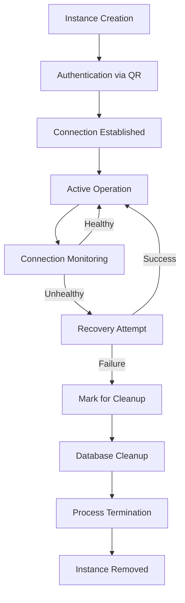

# Instance Management System Analysis and Proposed Solution

## Current System Analysis

The current WhatsApp bot instance management system operates with the following key components:

1. **Instance Lifecycle**:
   - Instances are created via the web UI and stored in the SQLite database
   - Each instance runs as an isolated Node.js process using the Baileys library
   - Authentication is handled via QR code scanning
   - Instances maintain persistent connections to WhatsApp Web

2. **Healing Mechanism**:
   - The system includes automatic reconnection logic when connections drop
   - WebSocket notifications provide real-time status updates
   - Database persistence ensures instance metadata survives process restarts

3. **Current Issues**:
   - Instances sometimes reappear after deletion
   - Instances get stuck in 'Parado' (Stopped) state
   - No comprehensive cleanup mechanism for failed instances
   - Limited error recovery and fallback mechanisms

## Root Cause Analysis

### Issue 1: Instances Reappearing After Deletion

**Potential Causes**:
1. Database records not being properly deleted when instances are removed
2. Process cleanup not completing before database operations
3. Race conditions between process termination and database updates
4. Caching mechanisms retaining instance data after deletion

**Evidence**:
- The system uses SQLite for persistence, which should provide atomic operations
- However, the current implementation may not properly synchronize between process cleanup and database updates
- No explicit transaction management for delete operations

### Issue 2: Instances Getting Stuck in 'Parado' State

**Potential Causes**:
1. Connection failures not being properly detected or handled
2. State transitions not being properly synchronized between components
3. Missing timeout mechanisms for stuck connections
4. Inadequate error handling in the Baileys connection logic

**Evidence**:
- The current code shows basic connection state management but lacks comprehensive error recovery
- No watchdog mechanism to detect and recover from stuck states
- Limited logging for state transition failures

## Proposed Robust System with Fallback Mechanisms

### 1. Enhanced Instance Lifecycle Management

### 2. Comprehensive Cleanup Mechanism

**Database Cleanup**:
- Implement proper transaction management for delete operations
- Add foreign key constraints to ensure referential integrity
- Create a dedicated cleanup service that runs periodically

**Process Cleanup**:
- Ensure all child processes are properly terminated
- Implement process monitoring to detect orphaned processes
- Add cleanup hooks for graceful shutdown

### 3. State Management Improvements

**State Transitions**:
- Define clear state transition rules
- Implement state transition validation
- Add comprehensive logging for all state changes

**Watchdog Mechanism**:
- Create a watchdog process that monitors instance health
- Implement timeout mechanisms for stuck states
- Add automatic recovery attempts with exponential backoff

### 4. Error Handling and Fallback Mechanisms

**Error Detection**:
- Enhance error detection in Baileys connection logic
- Add comprehensive error logging
- Implement error classification system

**Recovery Strategies**:
- Automatic reconnection with exponential backoff
- Fallback to alternative connection methods
- Graceful degradation when recovery fails

**Fallback Mechanisms**:
- Implement multiple connection strategies
- Add fallback to different WhatsApp Web endpoints
- Create backup communication channels

### 5. Monitoring and Alerting

**Health Monitoring**:
- Implement comprehensive health checks
- Add performance metrics collection
- Create dashboards for real-time monitoring

**Alerting System**:
- Configure alerts for critical failures
- Implement notification escalation
- Add automated recovery triggers

## Implementation Plan

### Phase 1: Database and Process Cleanup
1. Implement proper transaction management for instance operations
2. Create foreign key constraints for referential integrity
3. Develop cleanup service for orphaned instances
4. Add process monitoring and termination hooks

### Phase 2: State Management Enhancements
1. Define and implement state transition rules
2. Create state transition validation logic
3. Implement comprehensive state change logging
4. Develop watchdog mechanism for stuck states

### Phase 3: Error Handling and Recovery
1. Enhance Baileys error detection and classification
2. Implement automatic reconnection with backoff
3. Develop fallback connection strategies
4. Create graceful degradation mechanisms

### Phase 4: Monitoring and Alerting
1. Implement health check endpoints
2. Develop performance metrics collection
3. Create monitoring dashboards
4. Configure alerting and notification system

## Expected Outcomes

1. **Reliable Instance Management**: Instances will be properly created, managed, and deleted without reappearance
2. **Stable State Transitions**: Instances will transition smoothly between states without getting stuck
3. **Robust Error Recovery**: The system will automatically recover from most error conditions
4. **Comprehensive Monitoring**: Operators will have full visibility into system health and performance
5. **Improved User Experience**: End users will experience more reliable bot interactions

## Success Metrics

1. **Instance Stability**: 99.9% uptime for active instances
2. **Cleanup Effectiveness**: 100% of deleted instances properly removed
3. **State Transition Success**: 99.5% successful state transitions
4. **Recovery Rate**: 95% of errors automatically recovered
5. **Monitoring Coverage**: 100% of critical components monitored

## Risk Assessment

**High Risk**:
- Database corruption during cleanup operations
- Process termination failures leading to orphaned instances
- State transition deadlocks

**Mitigation Strategies**:
- Implement comprehensive backup and restore procedures
- Add process monitoring and manual intervention capabilities
- Create deadlock detection and resolution mechanisms

## Timeline

- **Phase 1**: 2-3 weeks
- **Phase 2**: 2-3 weeks  
- **Phase 3**: 3-4 weeks
- **Phase 4**: 2-3 weeks
- **Testing and Deployment**: 2-3 weeks

**Total**: 11-15 weeks for full implementation

## Resources Required

- 1-2 backend developers
- 1 database specialist
- 1 DevOps engineer for monitoring setup
- QA resources for testing
- Documentation specialist

## Dependencies

- Current system must remain operational during transition
- Database schema changes require careful migration planning
- Monitoring infrastructure must be in place before deployment

## Conclusion

This proposed system addresses the root causes of the current issues while providing a robust framework for instance management. The phased implementation approach allows for gradual improvement while maintaining system stability. The comprehensive monitoring and alerting will provide early warning of potential issues, enabling proactive intervention before problems affect end users.